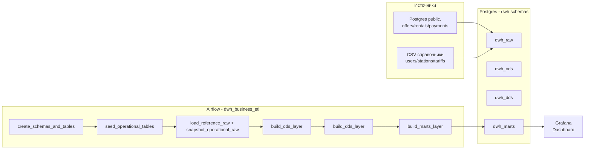

# Архитектура DWH для аренды пауэрбанков

## Компоненты и технологии
- **OLTP**: Postgres (`postgres` сервис) c таблицами `offers/rentals/payments` (микросервис rental-api, alembic).
- **ETL**: Airflow 2.10 (LocalExecutor) + Postgres metadata (`airflow-db`). DAG `dwh_business_etl` запускается из контейнера `airflow`.
- **Хранилище**: тот же Postgres, отдельные схемы `dwh_raw → dwh_ods → dwh_dds → dwh_marts`.
- **Данные-источники**: демо CSV из `dwh/sample_data/source` + справочники в `dwh/sample_data/reference`.
- **Витрина**: таблица `dwh_marts.dashboard_metrics`.
- **BI**: Grafana с datasource `DWH Postgres` и дашбордом `Powerbank DWH Metrics`.

## Логические слои
- **Raw** — копия источников, без трансформаций, добавляем `ingested_at`.
- **ODS** — очистка/нормализация, приведение типов, единичная запись на сущность.
- **DDS** — звёздная схема: `dim_date`, `dim_user`, `dim_station`, `dim_tariff`, факты `fct_rentals`, `fct_payments`.
- **Marts** — агрегаты для дашборда (`dashboard_metrics`).

## Поток данных

## Ключевые метрики витрины
1. **Daily revenue** — сумма `capture` платежей, `payment_success_rate` — успешные/все платежи.
2. **Rentals started / active** — спрос и текущая нагрузка по странам.
3. **Offer → rental conversion** — доля созданных офферов, дошедших до аренды.
4. **Average rental duration** (минуты) по завершённым арендам.
5. **Fallback pricing share** — доля аренд с `FALLBACK_GREEDY`.
6. **Avg ticket** — средний чек завершённых арендами.

## Где лежат артефакты
- DAG + логика ETL: `dwh/airflow/dags/dwh_business_etl.py`.
- Демо-данные: `dwh/sample_data/source`, `dwh/sample_data/reference`, готовая витрина `dwh/sample_data/marts/dashboard_metrics.csv`.
- Дашборд Grafana: `observability/grafana/dashboards/dwh_business.json` (datasource `DWH Postgres`).
