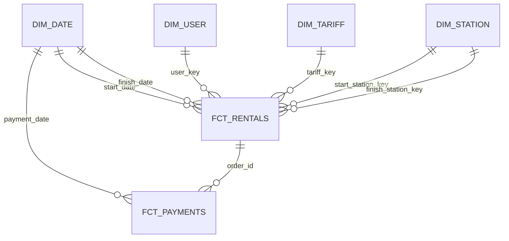

# Документация по таблицам DWH

## Слои
- **dwh_raw**: слепки источников, только техническое поле `ingested_at`
- **dwh_ods**: очищенные таблицы с единичной строкой на бизнес-сущность
- **dwh_dds**: измерения и факты звёздной схемы
- **dwh_marts**: агрегаты для дашборда

## Raw
| Таблица | Гранулярность | Ключевые поля |
| --- | --- | --- |
| dwh_raw.offers | 1 строка = 1 оффер | id, user_id, station_id, tariff_id, country, currency, pricing_mode, status, created_at, expires_at, ingested_at |
| dwh_raw.rentals | 1 строка = 1 аренда | id, offer_id, user_id, start/finish_station_id, country, currency, status, start_time, finish_time, total_amount, ingested_at |
| dwh_raw.payments | 1 строка = 1 платёж | id, order_id (rental), kind, status, amount, currency, created_at, ingested_at |
| dwh_raw.users | 1 строка = 1 пользователь | user_id, country, trusted, has_subscription, ingested_at |
| dwh_raw.stations | 1 строка = 1 станция | station_id, country, city, location, ingested_at |
| dwh_raw.tariffs | 1 строка = 1 тариф | tariff_id, country, currency, price_per_hour, free_period_min, default_deposit, ingested_at |

## ODS
Та же структура без `ingested_at`, данные очищаются/нормализуются перед загрузкой в DDS

## DDS (звезда)

| Таблица | Гранулярность | Важные поля |
| --- | --- | --- |
| dwh_dds.dim_date | 1 строка = 1 календарная дата | date_key (PK), year, month, day, week, weekday |
| dwh_dds.dim_user | 1 строка = 1 пользователь | user_key (PK), user_id (UK), country, trusted, has_subscription |
| dwh_dds.dim_station | 1 строка = 1 станция | station_key (PK), station_id (UK), country, city, location |
| dwh_dds.dim_tariff | 1 строка = 1 тариф | tariff_key (PK), tariff_id (UK), country, currency, price_per_hour, free_period_min, deposit |
| dwh_dds.fct_rentals | 1 строка = 1 аренда | rental_id (PK), user_key, start/finish_station_key, tariff_key, start_time, finish_time, country, currency, status, pricing_mode, total_amount, duration_min |
| dwh_dds.fct_payments | 1 строка = 1 платёж | payment_id (PK), order_id (rental_id), payment_kind, status, amount, currency, country, payment_created, payment_date, succeeded |

## Mart `dwh_marts.dashboard_metrics`
Гранулярность: **дата × страна × валюта**. Колонки:
- `offers_created`: количество созданных офферов.
- `rentals_started`: стартовавшие аренды, `active_rentals` — активные в момент выгрузки.
- `rentals_finished`: завершённые аренды.
- `revenue_capture`: сумма платежей `CAPTURE` в статусе `SUCCEEDED`.
- `payment_success_rate`: succeeded / все платежи за день.
- `offer_to_rental_conversion`: rentals_started / offers_created.
- `fallback_pricing_share`: доля аренд с `pricing_mode=FALLBACK_GREEDY`.
- `avg_duration_min`: средняя длительность завершённых аренд, минуты.
- `avg_ticket`: средний чек завершённых аренд.

## Статические артефакты
- Сырые демо-данные: `dwh/sample_data/source/*.csv`.
- Справочники: `dwh/sample_data/reference/*.csv`.
- Итоговая витрина (для проверки без запуска ETL): `dwh/sample_data/marts/dashboard_metrics.csv`.
